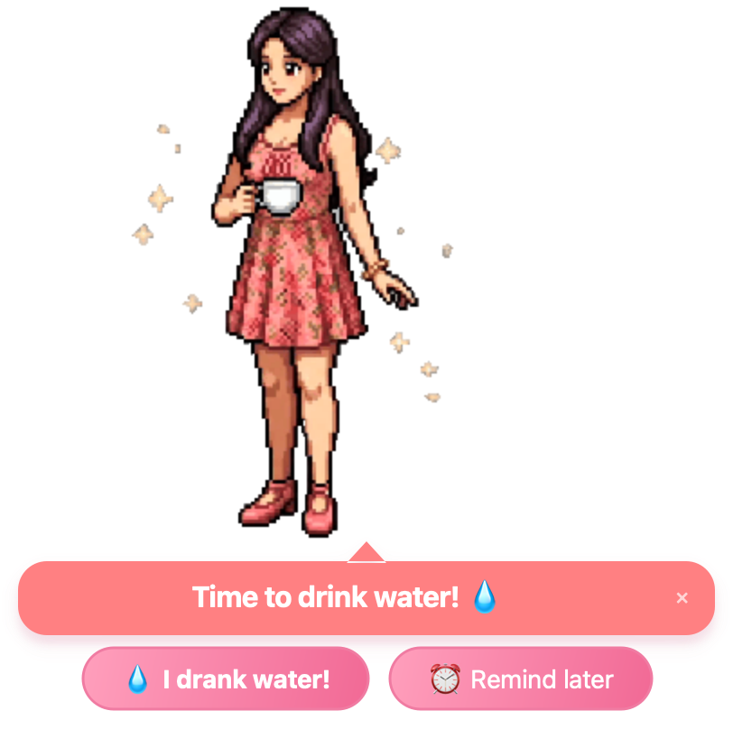
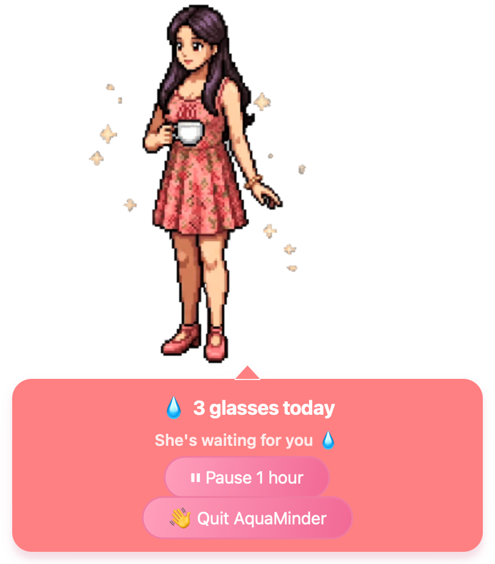

# 💧 AquaMinder (macOS)

Your pixel-art buddy floats in the bottom-right corner of your screen every
**30 minutes** to remind you to drink water.

<p align="center">
  
  
</p>

## Features

### Reminders
- ⏰ Pops up every **30 minutes** with a different cute message each time
- 🕗 Only between **8:00 and 23:00** — reminders due outside that window
  wait until the next morning at 8:00
- 😴 **Sleep-proof timing** — the countdown runs on the real clock, so if
  your Mac sleeps through a reminder, she appears seconds after it wakes
  instead of being delayed by the nap
- 💧 **I drank water!** → she says "Good job! 🎉 Stay hydrated!" for 3 seconds,
  then leaves and comes back in 30 minutes
- ⏰ **Remind later** → she disappears and comes back in **10 minutes**
- ✕ (in the bubble corner) → quits the app
- She also appears once right when you launch the app, so you can test it
- Plays a gentle system sound when she appears

### Looks
- 🧍‍♀️ Animated pixel-art girl (70 frames, ~10 fps) sipping her water
- 🫧 Fully **transparent background** — only she and her speech bubble float
  over your desktop, no window box
- 🌸 Pastel pink theme matched to her dress: coral speech bubble with a
  pointer, white text, pink gradient pill buttons

### Hidden panel — double-click her 🖱️
The reminder view stays minimal on purpose. Everything extra lives in a
panel that opens when you **double-click her**:
- 💧 **Glasses today** — every "I drank water!" click is counted
  (resets each morning, survives restarts)
- 🕐 **Next reminder time**
- ⏸ **Pause 1 hour** — for meetings / presentations
- 👋 **Quit AquaMinder**

Double-click again to close it.

### Behavior
- 🖥️ **Multi-monitor aware** — she appears on whichever screen your mouse
  is on, laptop or extended display
- ✋ **Draggable** — grab her and put her anywhere; she remembers the spot
  (as a fraction of the screen, so it maps onto any monitor)
- 🚫 **No Dock icon** — runs as a background (accessory) app; she's also
  invisible in the ⌘-Tab switcher
- 🤫 **Never steals focus** — she pops up without interrupting your typing
- 📌 Always on top, bottom-right corner, out of the way of the Dock

## Setup (one time)

The app uses **Qt (PySide6)** — Apple's built-in Python/Tk is too old and
draws a black box behind the character.

1. Open **Terminal** and `cd` into this folder:
   ```
   cd ~/Desktop/WaterReminder
   ```
2. Create a virtual environment and install PySide6
   (requires [Homebrew Python 3.12](https://brew.sh): `brew install python@3.12`):
   ```
   /opt/homebrew/bin/python3.12 -m venv venv
   venv/bin/pip install PySide6
   ```

## How to run

```
venv/bin/python water_reminder.py
```

Keep the Terminal window open (you can minimize it). To stop, click ✕ on the
popup or press Ctrl+C in Terminal.

## Run it in the background (optional)

To launch without keeping Terminal open:

```
nohup venv/bin/python water_reminder.py >/dev/null 2>&1 &
```

To stop it later: `pkill -f water_reminder.py`

## Start automatically at login (optional)

Create `~/Library/LaunchAgents/com.aquaminder.plist`:

```xml
<?xml version="1.0" encoding="UTF-8"?>
<!DOCTYPE plist PUBLIC "-//Apple//DTD PLIST 1.0//EN"
 "http://www.apple.com/DTDs/PropertyList-1.0.dtd">
<plist version="1.0">
<dict>
    <key>Label</key>
    <string>com.aquaminder</string>
    <key>ProgramArguments</key>
    <array>
        <string>/Users/YOU/Desktop/WaterReminder/venv/bin/python</string>
        <string>/Users/YOU/Desktop/WaterReminder/water_reminder.py</string>
    </array>
    <key>WorkingDirectory</key>
    <string>/Users/YOU/Desktop/WaterReminder</string>
    <key>RunAtLoad</key>
    <true/>
</dict>
</plist>
```

Then load it (starts her immediately and at every login):

```
launchctl bootstrap gui/$(id -u) ~/Library/LaunchAgents/com.aquaminder.plist
```

To remove: `launchctl bootout gui/$(id -u)/com.aquaminder` and delete the plist.

## Customize

Open `water_reminder.py` and edit the settings at the top:

- `REMINDER_INTERVAL_MIN = 30` — main reminder interval (minutes)
- `SNOOZE_MIN = 10` — "Remind later" snooze time (minutes)
- `ACTIVE_START_HOUR = 8` / `ACTIVE_END_HOUR = 23` — reminder hours
- `GOOD_JOB_SECONDS = 3` — how long "Good job! 🎉" stays on screen
- `SHOW_ON_LAUNCH = True` — pop up immediately when started
- `FRAME_DELAY_MS = 100` — animation speed (lower = faster)

Colors live just below the settings: `BUBBLE_BG` (speech bubble),
`STYLE` (message text / ✕ button), and `PILL_STYLES` (the two buttons).

## Troubleshooting

- **"Could not find the Qt platform plugin"** — macOS sometimes sets the
  hidden flag on files inside the venv. Fix: `chflags -R nohidden venv`
- **She never reappears** — make sure only one copy is running:
  `pkill -f water_reminder.py`, then start her again
